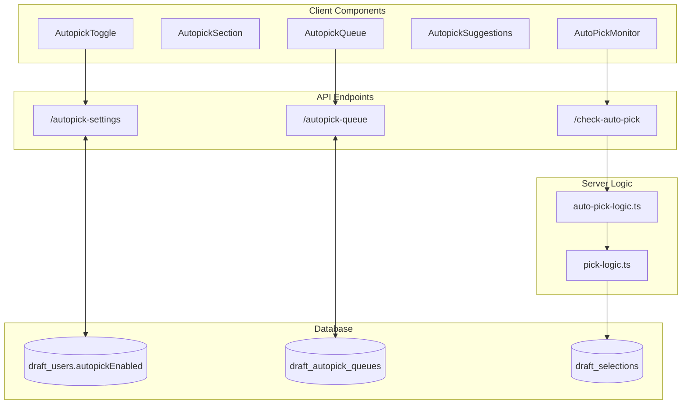

# Autopick System Overview

## Summary

This document outlines the complete autopick system implementation, including user queue management, automatic selection logic, and the data flow across different draft types (timed vs untimed, freeform vs curated).

## System Architecture



## Core Components

### 1. User Interface Components

#### AutopickToggle
- **Purpose**: Enable/disable autopick for the user
- **API**: `GET/PUT /api/drafts/[id]/autopick-settings`
- **Database**: Updates `draft_users.autopickEnabled`

#### AutopickQueue
- **Purpose**: Manage user's queue of preferred picks
- **Features**:
  - Add items (freeform text or curated options)
  - Drag-and-drop reordering
  - Direct selection with confirmation UI
  - Auto-save with debounced API calls (1 second delay)
  - Automatic cleanup when items are picked
- **API**: Full CRUD via `/api/drafts/[id]/autopick-queue`
- **Database**: Stores queue as JSONB array in `draft_autopick_queues`

#### AutopickSuggestions  
- **Purpose**: Show queue preview when user is on the clock
- **Behavior**: 
  - Only appears when `isMyTurn && !autopickEnabled && queue.length > 0`
  - Shows first 3 items from queue
  - Allows quick selection without enabling full autopick

#### AutoPickMonitor (Critical Component)
- **Purpose**: Detect when autopick should trigger
- **Trigger Conditions**:
  1. **Immediate**: `isMyTurn && autopickEnabled` (1 second delay)
  2. **Safety Net**: Timer expired for timed drafts (regardless of autopick setting)
- **Multi-Client Design**: All viewers monitor, any can trigger (important for offline players)

### 2. Server-Side Logic

#### auto-pick-logic.ts
Clean autopick execution logic with unified decision making:

```typescript
export async function performAutopick(draftGuid: string) {
  // 1. Validate draft is active
  // 2. Find current player by position
  // 3. Determine if autopick should run (immediate OR safety net)
  // 4. Rate limiting (5 second cooldown per user)
  // 5. Check if pick already made
  // 6. Get user's autopick queue
  // 7. Use queue item OR fallback to random/generated
  // 8. Create pick via shared pick-logic
  // 9. Update draft state for next player
}

// Clean decision logic
function shouldPerformAutopick(draft, currentPlayer) {
  // Case 1: User enabled autopick - immediate execution
  // Case 2: Timer expired - safety net (regardless of setting)
  // Case 3: No autopick needed
}
```

#### pick-logic.ts (New Shared Logic)
Unified pick creation logic used by both API routes and autopick:

```typescript
export async function createPick(options: CreatePickOptions) {
  // Handles all pick validation and database insertion
  // Used by both manual picks and autopicks
  // Supports skipTurnValidation for autopick
}
```

## Draft Type Variations

### Timed vs Untimed Drafts

#### Timed Drafts (`secPerRound > 0`)
- **Immediate Autopick**: When user enables autopick (immediate, like untimed)
- **Safety Net Autopick**: When timer expires (regardless of autopick setting)
- **Uses Player Queue**: Safety net tries user's queue first, then fallbacks
- **Grace Period**: 5 second minimum elapsed time before safety net

#### Untimed Drafts (`secPerRound = 0`) 
- **Autopick Trigger**: Immediately when user enables autopick and it's their turn
- **No Safety Net**: No timer expiry protection needed
- **Behavior**: Instant autopick when enabled

### Freeform vs Curated Drafts

#### Freeform Drafts (`draft.isFreeform = true`)
- **Queue Items**: Store text in `payload` field
- **Autopick Source**: Uses `item.payload` from queue
- **Fallback**: Generates "Auto Pick #1", "Auto Pick #2", etc.

#### Curated Drafts (`draft.isFreeform = false`)
- **Queue Items**: Store `curatedOptionId` reference
- **Autopick Source**: Fetches `optionText` from `draft_curated_options`
- **Validation**: Ensures curated option still exists and unused
- **Fallback**: Random selection from available curated options

## Data Flow Examples

### Typical Autopick Flow (Immediate Trigger)

```
1. User enables autopick              → draft_users.autopickEnabled = true
2. User adds items to queue           → draft_autopick_queues.queue = [...]
3. User's turn begins                 → draft.currentPositionOnClock = userPosition
4. AutoPickMonitor detects turn       → isMyTurn = true
5. Immediate trigger (1s delay)       → fetch("/check-auto-pick")
6. Server validates conditions        → shouldPerformAutopick() = true (autopick enabled)
7. Server gets first queue item       → queue[0] = {id, payload/curatedOptionId}
8. Server creates pick                → draft_selections insert
9. Server updates draft state         → next player's turn
10. UI updates via realtime           → pick appears, turn advances
```

### Safety Net Autopick Flow (Timed Drafts)

```
1. Player's turn begins               → draft.currentPositionOnClock = userPosition
2. Timer starts                       → draft.turnStartedAt = timestamp
3. Timer expires                      → elapsedSeconds >= secPerRound
4. Any viewer triggers safety net     → fetch("/check-auto-pick")
5. Server validates conditions        → shouldPerformAutopick() = true (timer expired)
6. Server gets first queue item       → queue[0] = {id, payload/curatedOptionId}
7. Fallback if no queue              → "Auto Pick #1" or random curated option
8. Server creates pick                → draft_selections insert
9. Server updates draft state         → next player's turn
10. UI updates via realtime           → pick appears, turn advances
```

### Queue Auto-Save Flow

```
1. User modifies queue                → drag/drop, add, delete
2. Component calls onQueueChange      → immediate optimistic update
3. Debounced save triggers (1s)       → PUT /autopick-queue
4. Save indicator shows state         → "dirty" → "saving" → "saved"
```

### Queue Cleanup Flow

```
1. Any pick made in draft             → recentPicks prop updates
2. AutopickQueue receives update      → cleanQueueBasedOnPicks()
3. Text normalization matching        → "My Pick" matches "my pick  "
4. Matching items removed             → queue.filter(...)
5. Database updated automatically     → onQueueChange triggers save
```

## Security & Performance

### Multi-Client Considerations
- **Race Conditions**: Prevented by rate limiting and duplicate pick checks
- **Server Load**: Multiple clients call autopick API, but internal safeguards prevent issues
- **Offline Players**: Other viewers can trigger autopick for absent players (key feature)

### Authentication Pattern (Simplified)
- **Previous**: Complex internal secret for server-to-server calls
- **Current**: Direct database operations via shared `createPick()` function  
- **Benefit**: No HTTP overhead, no secret management, simpler code

### Rate Limiting
- **Per User**: 5 second cooldown between autopick attempts
- **Cleanup**: Automatic cleanup of old rate limit entries

## API Reference

### Autopick Settings
```typescript
GET  /api/drafts/[id]/autopick-settings    // Get user's autopick enabled state
PUT  /api/drafts/[id]/autopick-settings    // Toggle autopick on/off
```

### Autopick Queue
```typescript
GET    /api/drafts/[id]/autopick-queue     // Get user's queue
POST   /api/drafts/[id]/autopick-queue     // Add item to queue  
PUT    /api/drafts/[id]/autopick-queue     // Replace entire queue (reorder)
DELETE /api/drafts/[id]/autopick-queue?itemId=...  // Remove item
```

### Autopick Trigger
```typescript
POST /api/drafts/[id]/check-auto-pick      // Unified autopick trigger
// Handles both immediate and safety net cases
// No authentication required (any viewer can trigger for offline players)
```

## Database Schema

### draft_users
```sql
autopickEnabled BOOLEAN DEFAULT FALSE  -- Per-user autopick preference
```

### draft_autopick_queues  
```sql
draftId     INTEGER    -- Foreign key to draft
userId      TEXT       -- User who owns this queue
queue       JSONB      -- Array of queue items
createdAt   TIMESTAMP
updatedAt   TIMESTAMP

-- Queue item structure:
{
  "id": "uuid",
  "payload": "text for freeform",           -- Optional
  "curatedOptionId": 123,                   -- Optional  
  "isUsed": false
}
```

## Key Design Decisions

### 1. Client-Side Monitoring
**Why**: Allows autopick for offline players - core feature requirement  
**Trade-off**: Multiple API calls vs system reliability

### 2. Shared Pick Logic
**Why**: Eliminates code duplication and authentication complexity  
**Before**: HTTP calls with internal secrets  
**After**: Direct database operations via `createPick()`

### 3. Unified Autopick Function
**Why**: Simpler architecture - one function handles both immediate and safety net cases  
**Implementation**: `shouldPerformAutopick()` contains all decision logic  
**Benefits**: Cleaner abstraction, easier testing, no duplicate queue lookup

### 4. Immediate Autopick for Timed Drafts
**Why**: Better UX - users expect autopick to work immediately when enabled  
**Safety Net**: Timer expiry still triggers autopick even when not enabled  
**Queue Priority**: Safety net uses player's queue first, just like immediate autopick

### 5. Queue Auto-Cleanup
**Why**: Prevents stale items when picks are made by any method  
**Implementation**: Normalized text matching across recent picks

### 6. Optimistic Updates with Auto-Save
**Why**: Responsive UI with automatic persistence  
**Implementation**: Debounced saves with visual state indicators

## Testing Scenarios

- [ ] **Immediate Autopick**: Enable autopick, verify immediate trigger when turn starts
- [ ] **Safety Net Autopick**: Timed draft, let timer expire, verify autopick without user setting enabled
- [ ] **Queue Priority in Safety Net**: Timer expires, verify safety net uses player's queue first
- [ ] **Freeform vs Curated**: Test different queue item types in both immediate and safety scenarios
- [ ] **Offline Player**: Enable autopick, close browser, verify others can trigger both modes
- [ ] **Queue Management**: Add, reorder, delete, verify auto-save
- [ ] **Queue Cleanup**: Make picks manually, verify queue items removed
- [ ] **Direct Selection**: Use +/Draft buttons for immediate picks from queue
- [ ] **Unified Function**: Both immediate and safety net use same API endpoint
- [ ] **Edge Cases**: Empty queue, invalid curated options, rate limiting, multiple client triggers